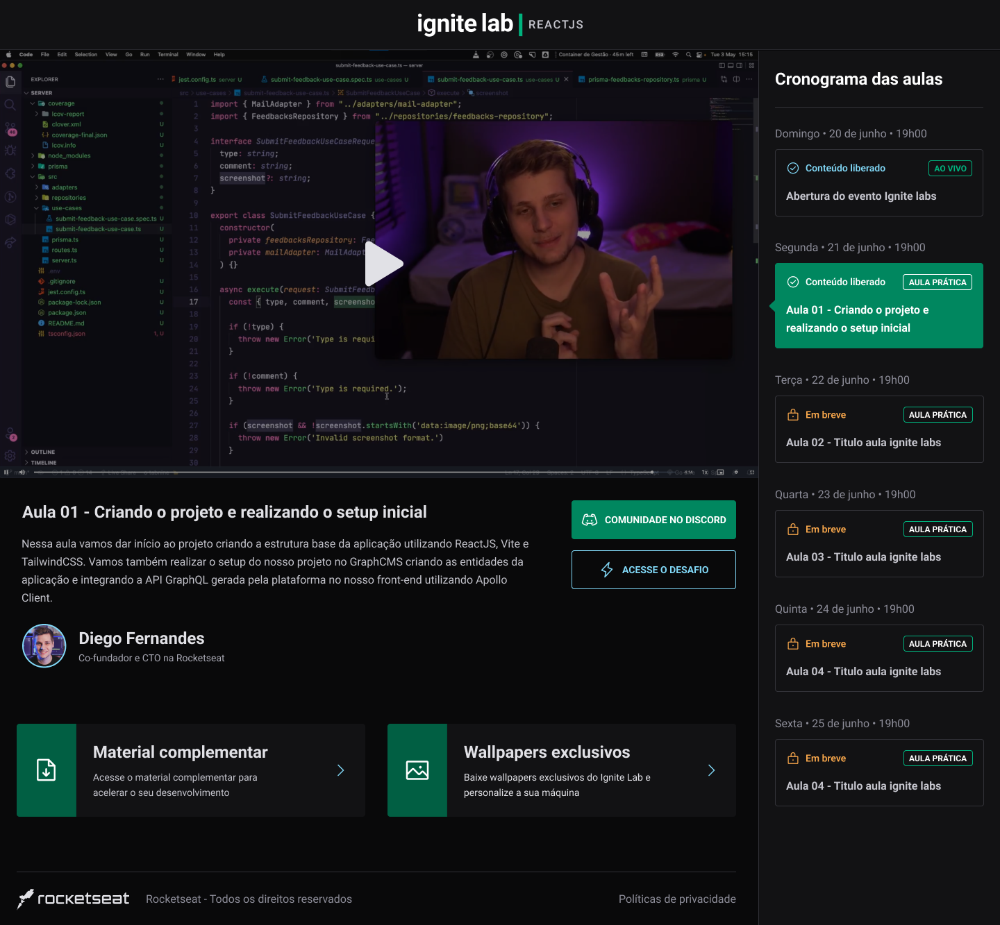

# :clapper: Ignite Lab 

<div align="center">
    
</div>

---
## :bookmark_tabs: Sobre
- O Ignite Lab, foi um evento realizado pela [Rocketseat](https://www.rocketseat.com.br/), com um projeto de uma plataforma de conteúdo, tendo como core da aplicação React, Tailwind e GraphQL, sendo justamente para aprendizagem sobre essas tecnologias.
---
## :art: Layout
- [Figma](https://www.figma.com/community/file/1120711251998877938)

---
## :gear: Techs
- [ReactJS](https://reactjs.org/)
- [TailwindCSS](https://tailwindcss.com/)
- [GraphCMS](https://hygraph.com/)
- [GraphQL Code Generator](https://www.graphql-code-generator.com/)

---
## :book: Features adicionadas
- Adição de responsividade, com auxílio do Tailwind

---
## :desktop_computer: Como usar
<p>Basta baixar ou fazer o clone do projeto no Github e executar os comandos abaixos na raiz do projeto:</p>

```
    yarn install
```
<p> O comando acima vai instalar as dependências do projeto </p> 


```
    yarn dev
```
<p> Já esse comando executa o projeto na máquina local. </p>

---

## :books: License
Arquivos sob a licença [MIT](https://github.com/lucasgomesgp) criado por Lucas Gomes.